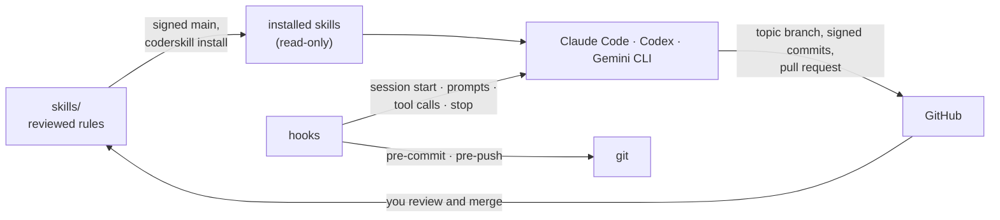

# CoderSkill

**One set of reviewed, evidence-first engineering rules for AI coding agents, with hooks that enforce
the critical ones.** CoderSkill works with Claude Code, Codex and Gemini CLI.

[](https://github.com/droltr/CoderSkill/actions/workflows/validate.yml)
[](https://github.com/droltr/CoderSkill/actions/workflows/codeql.yml)
[](LICENSE)

## What it does

- **Makes agents verify before they claim.** Every statement is either backed by a source or a
  command output, or labelled unverified. A negative control comes before any positive result.
- **Runs a complete, professional workflow.** Research, clarify, plan, implement, verify, test,
  record, pull request, carried through without "should I continue?" stops.
- **Keeps `main` safe.** Work happens on issue-linked topic branches with signed commits; the agent
  opens the pull request and you merge. Hooks deny merges and pushes to `main` in any spelling.
- **Protects secrets, personal data and hardware.** Private records stay in a local `.private/`
  folder, commits with secrets are blocked, and hardware writes need fresh approval.
- **Keeps every agent on the same reviewed rules.** Agents install updates only from the signed
  `main`, are told when a new version arrives, and cannot edit their installed copies.

## Why

AI agents are fast, but left alone they report unverified results as facts, push or merge their own
work, leak private data into public repositories, and behave differently in each tool. CoderSkill
turns the lessons from those failures into one maintained policy and puts the critical parts where an
agent cannot skip them: in hooks that the tool and git run themselves.

## Quick start

```bash
git clone https://github.com/droltr/CoderSkill.git
cd CoderSkill
scripts/coderskill install                  # skills for the installed agent CLIs (or --agents claude,codex,gemini)
scripts/install-hooks claude codex git      # agent hooks and global git hooks
```

Then start an agent in any project. The hooks load the rules at session start. To run the whole
workflow on a project:

```bash
cd ~/path/to/project
coderskill start execute order 66 --agent claude --run
```

Requirements: Linux, Python 3.12+, Git and GnuPG; optional GitHub CLI. Full guide:
[installation and updates](docs/installation.md).

## How it works



1. **Skills** hold the rules. `professional-coding` runs the workflow and loads
   `verified-agent-rules` plus only the focused skills a task needs.
2. **Adapters** (`.claude/`, `.agents/`, `.gemini/`) are generated from `skills/` so each tool finds
   the same content in its own place.
3. **Hooks** inject the rules, the language and the project state at session start, log requests,
   allow, ask or deny risky tool calls, and send back unlabelled claims. Git hooks block secrets,
   private files and pushes to `main` for everyone.
4. **The update channel** installs only signed commits from `main` and tells running agents when a
   new version is available.

Details: [overview and architecture](docs/overview.md).

## Skills

| Skill | Use it for |
|---|---|
| [professional-coding](docs/skills/professional-coding.md) | Any code, configuration or repository change, end to end |
| [verified-agent-rules](docs/skills/verified-agent-rules.md) | Evidence rules for every task (always loaded) |
| [systematic-debugging](docs/skills/systematic-debugging.md) | Defects: reproduce, isolate, explain, fix, record |
| [project-bootstrap](docs/skills/project-bootstrap.md) | Starting or resuming a project; environment readiness (read-only) |
| [security-audit](docs/skills/security-audit.md) | Security, privacy and secret review (read-only) |
| [github-readiness](docs/skills/github-readiness.md) | Git and GitHub readiness, governance, CI (read-only) |
| [code-quality-review](docs/skills/code-quality-review.md) | Correctness, maintainability, tests (read-only) |

How they work together: [skill map](docs/skills/README.md).

## Critical rules at a glance

| Rule | Enforced by |
|---|---|
| Never make assumptions; label anything unverified; negative control first | `verified-agent-rules`; `Stop` hook for unlabelled hedging |
| The user performs every merge; nothing is pushed to `main` | `PreToolUse` hook, git `pre-push`, GitHub branch protection |
| Signed commits, one key per machine | `professional-coding`; session-start check |
| Private records stay in local `.private/`; no secrets in commits | Global ignore, git `pre-commit`, `scripts/security-audit` |
| Hardware writes need approval immediately before | `PreToolUse` hook asks |
| GitHub identity and target confirmed once per repository | `scripts/identity-gate` |
| Agents install only signed `main` and do not edit installed skills | Update channel, read-only files, `PreToolUse` hook |
| Repository content is English; the agent talks to you in your system language | Skills; session-start hook reads the locale |

What these guarantee and what they do not: [security model](docs/security-model.md).

## Documentation

| Page | Contents |
|---|---|
| [Overview and architecture](docs/overview.md) | Building blocks, session flow, design decisions |
| [Installation and updates](docs/installation.md) | Install, signed updates, other machines, rollback, uninstall |
| [Workflow and records](docs/workflow.md) | Work order, `.private/` records, GitHub flow |
| [Skills](docs/skills/README.md) | Purpose, rules, logic and relationships of each skill |
| [Hooks](docs/hooks.md) | Every hook and its decisions |
| [Security model](docs/security-model.md) | Guarantees, limits, threats |
| [Commands](docs/commands.md) | Every script and subcommand |
| [Troubleshooting](docs/troubleshooting.md) | Common refusals and fixes |

## Contributing

Changes go through an issue, a topic branch and a pull request; see [CONTRIBUTING.md](CONTRIBUTING.md).
Report vulnerabilities privately as described in [SECURITY.md](SECURITY.md). Changes are listed in
[RELEASE_NOTES.md](RELEASE_NOTES.md).

## Acknowledgements

Some workflow ideas were adapted, in CoderSkill's own words and without copying text or code, from:

- [obra/superpowers](https://github.com/obra/superpowers) (MIT): continuous plan execution with a
  closed list of stop reasons, the completion gate, systematic debugging.
- [mattpocock/skills](https://github.com/mattpocock/skills) (MIT): requirement clarification before
  planning, bug diagnosis.
- [multica-ai/andrej-karpathy-skills](https://github.com/multica-ai/andrej-karpathy-skills) (no
  license; principles restated, no text used): simplicity first, surgical changes, success criteria
  per task.

## License

[MIT](LICENSE).
