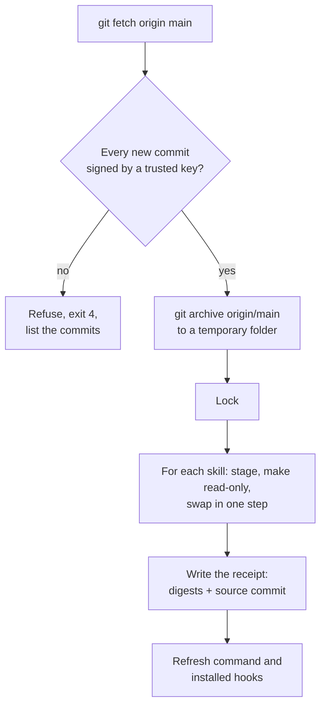
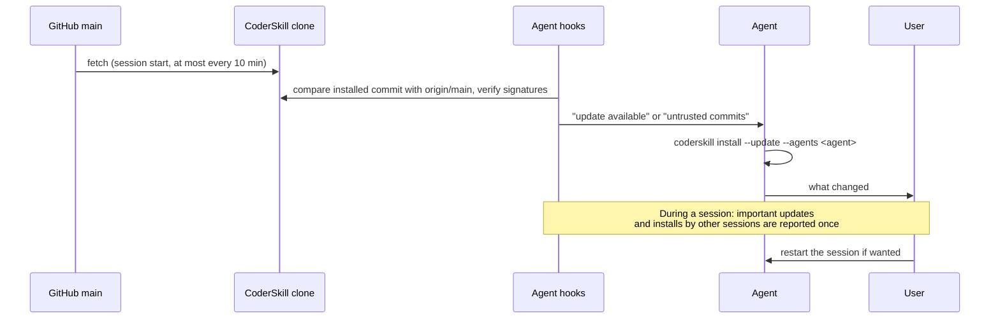

# Installation and updates

## Requirements

- Linux with Python 3.12 or newer and Git. macOS is expected to work but is not tested.
- GnuPG (`gpg`) to verify GitHub's signatures on `main`.
- At least one agent: Claude Code, Codex or Gemini CLI.
- Optional: GitHub CLI (`gh`) for the identity gate, issue and pull-request work.

## First install

```bash
git clone https://github.com/droltr/CoderSkill.git
cd CoderSkill
scripts/coderskill install                    # installed agent CLIs; --agents claude,codex,gemini to choose
scripts/install-hooks claude codex git        # agent and git hooks
```

The first `coderskill install`:

1. records this clone as the update source (`~/.config/coderskill/source.json`);
2. downloads GitHub's web-flow signing key from `https://github.com/web-flow.gpg` into a dedicated
   keyring (`~/.config/coderskill/trust/`) and accepts it only if its fingerprint matches the one
   pinned in `scripts/update_channel.py`;
3. installs the signed `origin/main` (next section);
4. installs the `coderskill` command as a copy under `~/.local/share/coderskill`, linked from
   `~/.local/bin/coderskill`.

## What an install does



- **Trusted signatures:** GitHub's web-flow key (squash merges made on github.com) or an SSH key
  listed in your git `gpg.ssh.allowedSignersFile`. Every commit after the installed one is checked,
  not only the newest. The first install checks the newest commit.
- **Only reviewed code:** the files come from `origin/main` with `git archive`, never from the
  working tree, so a checked-out topic branch or an uncommitted edit is never installed.
- **No lost work:** `.coderskill-installed.json` next to the skills records what was installed. An
  update replaces only skills that are unchanged since the last install; a locally changed skill
  stops the update (exit 3) until you run `--update --force`, which first moves it to
  `~/.local/share/coderskill/backups/`. Backups are outside the skill folders, so agents never load
  them as skills.
- **Consistent reads:** each skill folder is staged next to the target and swapped in one step under
  a lock, so a session never reads half an update. Skills that CoderSkill no longer ships are
  removed unless you changed them.
- **Read-only copies:** installed files lose their write permission, and the `PreToolUse` hook denies
  agent edits to them.

## Updates



- **At session start** the hook fetches `main` (one fetch at most every 10 minutes, shared by all
  sessions) and compares it with the commit this agent has installed. A trusted newer version makes
  the agent install it for itself and tell you what changed. Untrusted commits are reported and not
  installed.
- **During a session** the prompt hook reports, once each, an important update (changes to hooks,
  the installer or skill rules) and a new version installed by another session. Documentation-only
  changes wait for the next session start.
- **Reloading:** Claude Code picks up changed `SKILL.md` files in a running session
  ([official documentation](https://code.claude.com/docs/en/skills)). Whether to restart is your
  decision.
- **`git pull` of `main`** in the clone refreshes the state through the global `post-merge` hook.

> **⚠️ UNVERIFIED:** whether the Codex terminal UI and Gemini CLI reload skills during a session.
> To verify: change an installed `SKILL.md` mid-session and ask the agent to quote it.

### Merge with squash

GitHub signs squash merges made on github.com. A "Rebase and merge" creates unsigned commits, which
the update check refuses; this repository allows squash merges only.

## Commands

```bash
coderskill install --update                       # all installed agent CLIs
coderskill install --update --agents codex        # one agent
coderskill install --update --force               # back up locally changed skills, then replace them
scripts/coderskill install --update --worktree    # owner only: install the working tree while developing
python3 ~/.config/coderskill/scripts/update_channel.py status --agent claude   # current state as JSON
```

## Another machine

Clone, run the first install, and set up commit signing with a new key for that machine (never copy
a private key): see the commit-signing section of
[`environment-bootstrap.md`](../skills/professional-coding/references/environment-bootstrap.md).
Add the new public key to `gpg.ssh.allowedSignersFile` on every machine that should trust commits
pushed directly from it.

## Rollback

- To an earlier version: check out the earlier commit in the clone and run
  `scripts/coderskill install --update --worktree` (owner action), or revert the change on `main`
  through a pull request.
- To earlier copies of a skill: restore the folder from `~/.local/share/coderskill/backups/`.

## Uninstall

1. Remove the skill folders listed in `~/.claude/skills/.coderskill-installed.json` (and the Codex and
   Gemini equivalents), then the receipt files.
2. Remove the CoderSkill entries from `~/.claude/settings.json`, `~/.codex/hooks.json` and
   `~/.gemini/settings.json` (commands containing `coderskill_hook.py`).
3. `git config --global --unset core.hooksPath`, and remove the CoderSkill lines from the global
   git ignore file if you no longer want them.
4. Remove `~/.config/coderskill`, `~/.local/share/coderskill`, `~/.local/state/coderskill` and
   `~/.local/bin/coderskill`.
