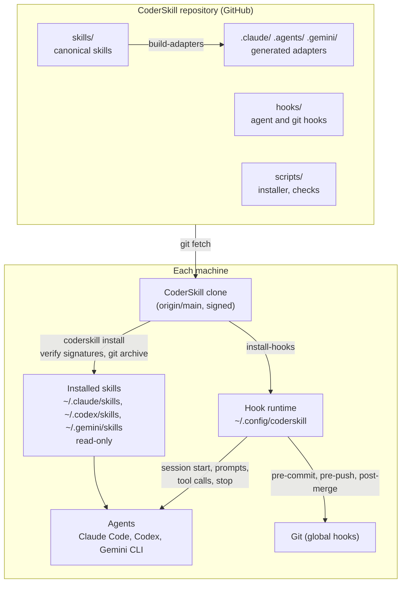
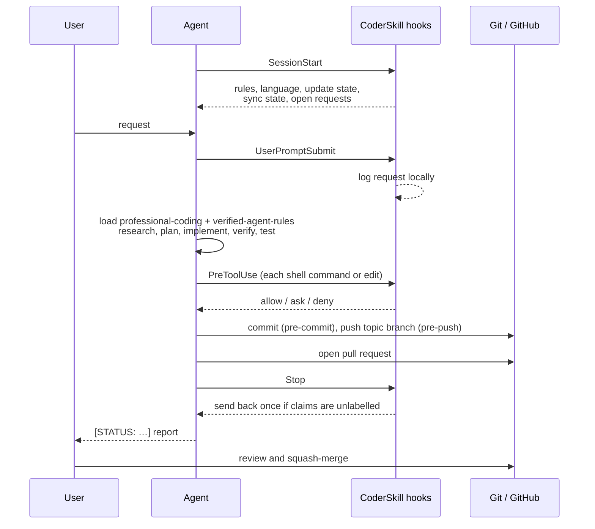

# Overview and architecture

## The problem

AI coding agents are fast and capable, but left alone they tend to:

- report results they have not verified, and act on them;
- push to `main`, merge their own work, or leak private data into public repositories;
- stop after every step and wait for "continue", or never stop when they should;
- behave differently in Claude Code, Codex and Gemini CLI, because each tool reads different
  instruction files from different places.

CoderSkill gives all of them one reviewed set of rules, and enforces the critical ones with hooks.

## Building blocks

| Part | Role |
|---|---|
| `skills/` | The canonical rules: one workflow skill and six focused skills ([skills](skills/README.md)). |
| `.claude/`, `.agents/`, `.gemini/` | Copies generated by `scripts/build-adapters` with a digest manifest (`adapters/manifest.json`); CI fails on drift. `AGENTS.md`, `CLAUDE.md` and `GEMINI.md` point each tool at its copy. |
| `hooks/` | Agent hooks (session start, prompts, tool calls, stop, session end) and git hooks ([hooks](hooks.md)). |
| `scripts/` | Installer and update channel, checks, validators and planning helpers ([commands](commands.md)). |
| `tests/` | Unit tests for hooks, installer, update channel, audit and validators, each with negative controls. |
| `standards/registry.yml` | Versioned external standards (OWASP ASVS, NIST SSDF, …) that the security checks refer to. |
| `config/dependencies.json` | Machine-readable record of vendored dependencies (none at present). |
| `knowledge/` | Template for durable project lessons, validated by `scripts/validate-lesson`. |
| `.coderskill/project.yml.example` | Template project profile: repository, visibility, active GitHub capabilities. |

## How a session runs

## Design decisions

| Decision | Reason |
|---|---|
| One canonical source, generated adapters | Tools read different paths; generating them avoids hand-edited copies that drift. |
| A workflow skill plus focused skills | Narrow requests load only what they need; each concern has one place. |
| Hooks for the critical rules | A rule that matters must not depend on the agent choosing to read it. |
| Agent hooks fail open, git hooks fail closed | A broken agent hook must not stop all work; a commit or push must not pass unchecked. |
| The user performs every merge | The reviewed `main` is what installations and other projects depend on. |
| Installs only from signed `main` | Every agent runs the same reviewed rules; nothing unreviewed is installed. |
| Private records stay local | Requests, research and session notes often contain private detail; GitHub holds the public part. |
| English repository, user's language in conversation | Public artifacts stay usable by anyone; the user gets answers in the system language. |
| Standard library only (except PyYAML for two validators) | Nothing to install for the hooks and the installer; fewer supply-chain risks. |

## Supported tools

| Tool | Instructions file | Skill copy read by the tool | Hooks |
|---|---|---|---|
| Claude Code | `CLAUDE.md` | `~/.claude/skills/` | All events, including `PreToolUse` |
| Codex | `AGENTS.md` | `~/.codex/skills/` | Session start, subagents, prompts, stop, session end |
| Gemini CLI | `GEMINI.md` | `~/.gemini/skills/` | Session start |

Sources for the tool behaviour: Claude Code [skills](https://code.claude.com/docs/en/skills) and
[hooks](https://code.claude.com/docs/en/hooks); Codex `codex-rs` source (tag `rust-v0.162.1`);
Gemini CLI [skills](https://geminicli.com/docs/cli/using-agent-skills/) and
[hooks reference](https://github.com/google-gemini/gemini-cli/blob/v0.63.0/docs/hooks/reference.md).
