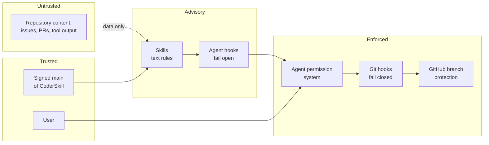

# Security model

CoderSkill reduces the damage an AI coding agent can do by mistake. It is not a sandbox and does not
stop a determined attacker who controls the agent. This page states what it guarantees, what it does
not, and why.

## Trust boundaries

| Layer | Enforces | Can be bypassed by |
|---|---|---|
| Skills | Everything, as instructions | An agent that ignores them |
| Agent hooks | Selected rules at tool-call time | Commands the parser does not understand (for example a write inside `python -c`) |
| Agent permission system | What the agent may run at all | User configuration only |
| Git hooks | No `.private/` or secrets in commits, no pushes to `main` | `--no-verify` and `core.hooksPath` overrides, which the agent hooks deny; the user can still use them |
| GitHub branch protection | No direct pushes, linear history, required checks | Repository administrators |

## What is guaranteed

- **`main` is changed only through pull requests the user merges.** Agent hooks deny merges and
  protected pushes in every spelling they recognize; the git `pre-push` hook reads the refs git is
  about to push, so the command spelling does not matter; GitHub branch protection is the last layer.
- **Private records stay local.** `.private/` and `.agent-sessions/` are ignored and rejected by the
  global `pre-commit` hook.
- **Secrets are blocked at commit time** for the critical patterns in `scripts/security_audit.py`
  (tokens and private keys).
- **Installed skills come only from signed `main`.** Every commit since the installed one must be
  signed by GitHub's pinned web-flow key or an allowed SSH signer, and the files come from
  `git archive`, not from the working tree.
- **Hardware writes need a fresh approval** for the commands the hook knows.

## What is not guaranteed

- **Command parsing is best effort.** A write hidden inside an interpreter call, a variable or an
  unusual tool can pass the agent hook. Read-only installed files and the git hooks are the second
  layer.
- **Agent hooks fail open.** An internal error lets the tool call through rather than block the
  agent.
- **Codex and Gemini CLI have fewer hooks** (no `PreToolUse`), so their protection relies more on
  the skills, file permissions and git hooks.
- **The secret scanner is pattern based.** It finds known token formats and private keys, not every
  secret.
- **History rewriting does not remove copies** in forks, pull-request refs or caches; that needs
  GitHub Support.

## Threats considered

| Threat | Control |
|---|---|
| Prompt injection through repository files, issues or tool output | Skills treat such content as data; hooks act on tool calls, not on text |
| A repository that redirects hook writes with symlinks or ignore rules | `.agent-sessions/` is used only when it is a real, ignored, untracked folder; writes use `O_NOFOLLOW` and atomic replacement |
| Pushing to the wrong account or repository | Identity gate, recorded per repository |
| Leaking personal data in a public repository | `.private/`, global ignore, `pre-commit`, `scripts/security-audit` (e-mail addresses, home paths, addresses) |
| A tampered or unreviewed skill update | Signed-commit check over the whole range, pinned GitHub key, `git archive` snapshot |
| An agent editing its own rules | Read-only installed copies, `PreToolUse` denial, change requests through `coderskill request` |
| Supply-chain changes in CI | Actions pinned to commit SHAs, pinned PyYAML, CodeQL |

## Reporting

See [SECURITY.md](../SECURITY.md): use GitHub private vulnerability reporting, never a public issue,
for vulnerabilities or exposed data.
