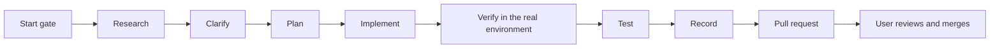

# professional-coding

Source: [`skills/professional-coding/SKILL.md`](../../skills/professional-coding/SKILL.md)

## Purpose

`professional-coding` runs a software change from the first question to a reviewed pull request.
It makes the agent behave the same way in Claude Code, Codex and Gemini CLI. It researches before
it builds, verifies before it claims, keeps `main` safe, protects secrets and hardware, and leaves a
record of what was asked and how it was met.

## When it is used

- Before the first code, configuration or repository change in any project, including small edits,
  helper scripts and tooling inside a notes vault.
- For multi-phase work: a feature, a fix, a migration, a new project.

It is not needed for a pure question or for a check-only review; a focused review skill covers
those.

## How it works

1. **Start gate.** Load this skill and `verified-agent-rules`, add only the focused skills the task
   needs, check that the required tools are installed, read `AGENTS.md`, `CLAUDE.md` and the project
   profile, and name the selected skills and tools in the first progress note.
2. **Work order.** Research, clarify, plan, implement, verify that it works, test, record, pull
   request (see [workflow](../workflow.md)).
3. **Continuous execution.** Once the user asks for in-scope work, the agent carries it through
   every phase in one run. It does not ask "should I continue?".
4. **Delivery.** Issue → topic branch → signed commits → pushed branch → pull request with
   validation, safety impact and rollback. The user merges.

## Rules and why they exist

### Continuous execution and the closed stop list

The agent stops and asks only for one of seven reasons:

1. a missing or ambiguous requirement that changes what gets built;
2. a destructive or irreversible action;
3. an outside change the user has not authorized, such as repository creation, settings,
   releases, messages or merges;
4. a credential or permission step only the user can do;
5. a physical hardware write;
6. the first identity and target confirmation for a repository, or a change of it;
7. a verified blocker after safe alternatives were tried.

**Why:** agents that pause at every checkpoint make the user type "continue" again and again. A
closed list removes the guesswork. Uncertainty about a fact is not on the list: the agent labels it,
continues with independent work, and stops only the action that depends on it.

### Status markers

The message that ends a turn starts with one marker: `COMPLETE`, `WAITING_FOR_USER`, `BLOCKED`,
`FAILED` or `IN_PROGRESS` (only while background work continues). **Why:** the user can see at a
glance whether anything is expected of them. Markers only go on the final message, because a
message without a tool call ends the agent's turn.

### Coding discipline

The least code that meets the verified requirement. Change only what the task needs. Define the
success criterion first, preferably as a failing test. Use `systematic-debugging` for defects.
**Why:** small, surgical changes are easier to review and less likely to break working behaviour.

### Language

The repository is English; the user is addressed in the operating system's language.
**Why:** one language for public artifacts keeps the project usable by anyone, while the user gets
answers in the language they work in.

### GitHub identity and target gate

The agent confirms the GitHub account, the `origin` repository and the user's target once per
repository and records the confirmation in `.coderskill/local/identity.json` (git-ignored). Any later
difference stops pushes, issues and pull requests. `scripts/identity-gate` implements it.
**Why:** pushing to the wrong account or repository is hard to undo and can publish private work.
Asking once per repository, not on every task, avoids needless stops.

### Repository development decisions

- `main` is the reviewed baseline. No direct commits, no pushes; changes go through pull requests
  from `feature/`, `fix/`, `security/`, `docs/`, `test/` or `chore/` branches linked to an issue.
- The user performs every merge, even after approving it. Passing CI is required but is not
  approval.
- Squash merge; linear history; no history rewriting except to remove sensitive data, then with
  `--force-with-lease`.
- Every commit and tag is signed, with one signing key per machine that is never copied. Signing is
  checked before the first commit on a machine; GitHub verification is checked before review.

**Why:** a protected, reviewed `main` is what installations and other projects depend on. Signatures
prove where a commit came from; the update channel relies on them.

### GitHub compatibility

Lowercase kebab-case names for new folders and repositories, `vT.B.A` release tags, issue forms,
labels and templates chosen by project type, priority labels for defects, and one project at a time.
**Why:** names that work on every platform and a predictable tracker make projects portable.

### Repository visibility and dependency provenance

New repositories are private under `droltr` unless the owner records `visibility: public` in the
project profile. Private working files stay in the git-ignored `.private/` folder. External code is
recorded (upstream, license, revision, date), mirrored privately for provenance, vendored under
`vendor/<dependency>` with `git subtree`, pinned to an immutable commit, and updated only through its
own pull request. **Why:** private by default limits leaks; pinned, recorded dependencies make every
build reproducible and every license obligation visible.

### Compatibility, stability and hardware safety

Preserve verified behaviour, keep experiments isolated, never replace a working service before the
replacement is tested. HID, SMBus, I²C, firmware and RGB controller writes are potentially
destructive: no experimental packets, one selected device and zone, a safe starting value, explicit
authorization immediately before each first or risky write, and a tested rollback. Mocks never count
as hardware verification. Project-specific OpenRGB and Mystic Light rules live in
[`references/openrgb-mystic-light.md`](../../skills/professional-coding/references/openrgb-mystic-light.md)
and apply only to those projects. **Why:** a wrong write can damage hardware; these rules come from
a real incident.

### Security and privacy

No credentials, tokens, keys or secret-bearing configuration in commits; no serial numbers or other
unique identifiers; redact diagnostics (serials, user and host names, home paths, IP and MAC
addresses, tokens) before publishing. Report vulnerabilities privately. When something sensitive was
committed: stop distribution, rotate, remove, rewrite history if needed, verify, and remember that
forks, pull-request refs and caches keep copies. **Why:** a public repository is permanent; most of
the damage happens before anyone notices.

### Required validation, governance and completion

Run the repository's own checks (tests, linters, `bash -n`, `git diff --check`), validate changed
YAML, confirm required CI, scan for secrets, and report skipped checks. Governance: issue forms, no
blank issues, a pull-request template, CODEOWNERS, Dependabot, secret scanning, push protection,
private vulnerability reporting, least-privilege Actions. Completion claims follow the completion
gate of `verified-agent-rules`. **Why:** a claim of "done" is only worth the evidence behind it.

### CoderSkill updates and change requests

Installed CoderSkill skills are read-only for agents. When a hook reports an update, the agent runs
`coderskill install --update --agents <agent>`, which installs only the signed `main`, and tells the
user. A needed rule change is recorded with `coderskill request`, not made in the installed copy.
**Why:** every agent should run the same reviewed rules, and every rule change should go through a
pull request. See [installation](../installation.md).

## References

| File | Read when |
|---|---|
| [`environment-bootstrap.md`](../../skills/professional-coding/references/environment-bootstrap.md) | New environment, new repository, installing tools, Git/GitHub setup, commit signing |
| [`project-lifecycle.md`](../../skills/professional-coding/references/project-lifecycle.md) | Creating or resuming a project: discovery, synchronization, purpose, language choice, publication |
| [`work-records.md`](../../skills/professional-coding/references/work-records.md) | Work order and the `.private/` record formats |
| [`github-capabilities.md`](../../skills/professional-coding/references/github-capabilities.md) | Choosing GitHub features by project type |
| [`openrgb-mystic-light.md`](../../skills/professional-coding/references/openrgb-mystic-light.md) | OpenRGB, `game-lighting`, Mystic Light, Hardware Sync projects only |

## Relationships

- Always loads [verified-agent-rules](verified-agent-rules.md).
- Routes defects to [systematic-debugging](systematic-debugging.md), startup to
  [project-bootstrap](project-bootstrap.md), and reviews to [security-audit](security-audit.md),
  [github-readiness](github-readiness.md) and [code-quality-review](code-quality-review.md).
- `project-bootstrap` reuses its references.

## Outputs

Issues, topic branches, signed commits, pull requests with validation, safety impact and rollback,
local records in `.private/`, and a completion report.

## Limits

The skill is text: an agent can ignore it. The hooks enforce the most important rules (see
[hooks](../hooks.md)); the agent's permission system and GitHub branch protection remain the hard
boundaries.
