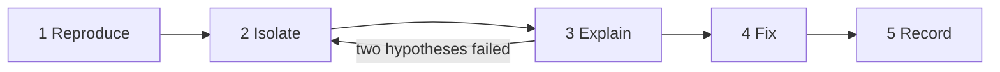

# systematic-debugging

Source: [`skills/systematic-debugging/SKILL.md`](../../skills/systematic-debugging/SKILL.md)

## Purpose

Find and fix the root cause of a defect with evidence instead of guesses. A change made "to see if
it helps" without a hypothesis is not debugging.

## When it is used

A defect, a failing test, a crash, a regression or unexplained behaviour. Not for new features or
reviews.

## How it works

1. **Reproduce.** Write down expected and actual behaviour with the exact input, version, platform
   and configuration. Reproduce it yourself. Capture it as a failing test or a minimal script: that
   test is the success criterion. Never claim a fix for a failure you could not observe.
2. **Isolate.** Narrow the path: smallest input, last good revision (`git bisect`), one component,
   one configuration change. Read the code and documentation on that path. Use a negative control to
   confirm that the probe tells a failing case from a working one.
3. **Explain.** One hypothesis at a time, each with the observation that would confirm or refute it;
   keep a short log. After two failed hypotheses in a row, stop changing code and return to step 2.
   The root cause is found only when it explains every symptom.
4. **Fix.** The smallest change that removes the cause, with no refactoring mixed in. The
   reproduction test must pass, and must fail again when the fix is reverted. Then run the full
   relevant test suite.
5. **Record.** Keep the reproduction as a regression test. State the root cause, evidence, fix and
   what remains unverified in the pull request and the session record. Report wider impact in a
   separate issue instead of widening the fix.

## Rules and why they exist

- **Reproduce first.** Without a reproduction, a "fix" cannot be checked.
- **The test must fail without the fix.** This proves the test covers the defect (a mutation check).
- **Stop after two failed hypotheses.** Stacked guesses hide the real cause and leave dead changes.
- **Smallest fix, no mixed cleanup.** A focused diff shows reviewers exactly what changed and why.
- **Hardware and system defects are diagnosed read-only.** A write to hardware, firmware or a running
  service is not a probe; it follows the hardware rules and needs authorization.

## Relationships

- Called from [professional-coding](professional-coding.md) for defects.
- All claims follow [verified-agent-rules](verified-agent-rules.md).

## Outputs

A regression test, a minimal fix on a topic branch, and a pull request that names the root cause and
the evidence.

## Limits

Some defects cannot be reproduced locally (hardware, production-only data). The skill then requires
more data before any change and an explicit "unverified" for what only mocks covered.
