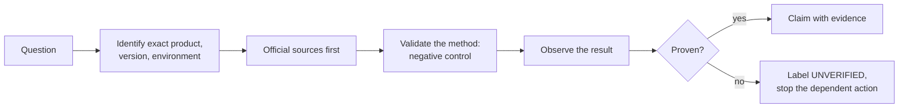

# verified-agent-rules

Source: [`skills/verified-agent-rules/SKILL.md`](../../skills/verified-agent-rules/SKILL.md)

## Purpose

`verified-agent-rules` defines what an agent may claim. Its first rule is absolute: **never make
assumptions.** Every statement is either verified, with its source, or labelled unverified, with what
would verify it.

The skill exists because of a failure mode the owner calls "Icarus syndrome": an agent wants a
problem solved so much that it starts believing its own unverified results and reports them as
facts. In a real incident, a phantom "device found" result from a hardware probe led to a hardware
write. These rules make that sequence impossible to follow without breaking an explicit rule.

## When it is used

Every coding, research, hardware or system-change task. `professional-coding` loads it in its start
gate, and every other skill's claims follow it.

## How it works

The skill is a set of gates the agent applies to its own work:

## Rules and why they exist

### Evidence and truthfulness

- Claim only what was observed or is backed by authoritative documentation.
- Separate facts, observations, inferences, hypotheses and proposed tests.
- Record the exact evidence: command output, logs, readback, file state, API response, document
  section, version, date, source URL.
- Never turn a failed, partial, indirect, stale or simulated check into a success.
- Do not believe your own proposed solution; name the observation that would prove it.
- When a finding is disproved, retract it everywhere it appears: code comments, reports, plans,
  memory and summaries.

**Why:** a confident wrong answer costs more than an honest "not verified".

### Research and sources

Identify the exact product, OS, firmware, driver, library and versions; read official sources first;
use forums and issue trackers as leads, not proof; never generalize from a similar product or another
version without proving it applies; read project instructions, code, tests and research notes before
editing. **Why:** most wrong conclusions come from the right answer for a different version.

### Coding and repository changes

Keep experiments and generated files apart from stable code; inspect the staged diff before every
commit; learn the toolchain and contribution rules first; check callers and installed copies before
changing an interface; make the smallest supported change; validate behaviour at runtime, not only
by syntax; report skipped checks; verify the artifact users actually run. **Why:** a passing build
does not prove that the installed program works.

### Tools, probes and proof levels

- Learn what a tool really does in this environment before reading its output.
- **Run a negative control before trusting a positive result.** If the control also says "yes",
  the method is broken and every result from it is void.
- Treat all-zero, all-0xFF, constant or cached output as a red flag.
- Exit code 0, an ACK or "OK" only means the call returned.
- Never silently install, switch or substitute a tool.
- Keep proof levels apart: source reading, compilation, dry run, mock test, read-only probe,
  physical write, readback and human observation each prove something different.

**Why:** the hardware incident started with a probe whose method had never been validated.

### Hardware and low-level resources

Identify the exact device first; start read-only; map fields only from manufacturer or primary
sources; never write a value because it looks like another device's; get authorization immediately
before the first or a risky write; keep a restore path; rate-limit; read back; and never equate a
software scale with physical power or temperature. **Why:** hardware writes can be irreversible.

### System, service and UI changes

Establish the active installation, user, permissions and running process first; prefer reversible,
scoped changes; find out whether a change needs a reload, restart or reboot; after the change verify
the file, mode, process, logs and the visible result. **Why:** writing a config file does not prove
that the running service uses it.

### Reporting and stopping

Lead with the verified outcome and its evidence; never fill gaps with defaults; preserve conflicting
evidence; before a high-impact action name the expected result, rollback and stopping condition.

### Completion gate

Before saying something is done, fixed, passing or working: name the proving command, run it now in
full, read the whole output, and only then make the claim with the evidence next to it. Earlier runs
and other agents' reports do not count. **Why:** "it passed earlier" is how regressions get shipped.

### Labels

Unverified statements carry a label at the start of the line: `⚠️ UNVERIFIED` (with "To verify: …")
or `⚠️ ASSUMPTION` (with "Based on: …") in repository text; the user-facing equivalents in the user's
language. Hedging words such as "probably" without a label are not allowed; the `Stop` hook sends
a final answer that uses them back once for rewriting (see [hooks](../hooks.md)).

## References

[`failure-prevention-checklist.md`](../../skills/verified-agent-rules/references/failure-prevention-checklist.md)
is the mandatory self-check before claiming a result, changing a repository, touching hardware,
changing a service or recording a conclusion. It groups the rules above into short prompts:
truthfulness, research gates, probe discipline, hardware safety, repository and runtime discipline,
and the completion gate.

## Relationships

- Loaded by [professional-coding](professional-coding.md) for every task.
- [systematic-debugging](systematic-debugging.md) and every review skill follow it for their claims.

## Outputs

None of its own; it shapes every claim, report and record the agent produces.

## Limits

The `Stop` hook catches unlabelled hedging words, not every unverified claim. The rule depends on
the agent applying it; the completion gate makes skipping it visible.
