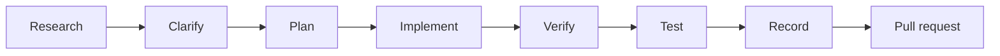

# Workflow and records

This is how an agent with CoderSkill works on a project, and where each kind of information is kept.

## Work order



| Step | What happens | Evidence |
|---|---|---|
| Research | Read the project, official sources and earlier research notes. | `.private/research/` |
| Clarify | Ask only when a missing requirement changes what gets built. | The request entry |
| Plan | Define the success criterion of each task, preferably as a failing test. | `.private/plans/` |
| Implement | The least code that meets the requirement, on a topic branch. | Commits |
| Verify | Show that it works in the real environment, not only in tests. | Command output |
| Test | Run the repository's checks; each new rule gets a negative control. | Test output |
| Record | Update the request status and how it was met; write the session record. | `.private/requests.md`, `.private/sessions/` |
| Pull request | Validation, safety impact and rollback; the user reviews and merges. | GitHub |

Details and record formats:
[`work-records.md`](../skills/professional-coding/references/work-records.md).

## Two layers: public GitHub, private local folder

| Kept on GitHub | Kept locally in `.private/` (never pushed) |
|---|---|
| Code, tests, documentation | Every request, its status and how it was met |
| Issues, pull requests, reviews | Research notes and sources |
| Release notes | Plans and decision records |
| CI results | Session records, personal notes |

`.private/` and `.agent-sessions/` are in `.gitignore` and in the global git ignore file, and the
global `pre-commit` hook rejects them even if someone force-adds them. To share them between
machines, use your own file-synchronization tool. Public issues, pull requests and commits must not
contain private details, local paths or personal data.

## GitHub flow

1. **Identity gate.** The first time in a repository, the agent shows the GitHub account, the
   `origin` repository and your target, and records your confirmation in
   `.coderskill/local/identity.json`. Later differences stop pushes, issues and pull requests.
2. **Issue.** One issue per meaningful change.
3. **Branch.** `<prefix>/<issue>-<slug>` with `feature/`, `fix/`, `security/`, `docs/`, `test/` or
   `chore/`.
4. **Signed commits.** Every commit is signed with this machine's own key.
5. **Pull request.** Summary, related issue, validation, hardware and safety impact, rollback. CI
   must pass.
6. **Merge.** You review and squash-merge. The agent never merges and never pushes to `main`; the
   hooks enforce this.

## Continuous execution

Once you ask for in-scope work, the agent carries it through every step without asking "should I
continue?". It stops only for the closed list of reasons in
[professional-coding](skills/professional-coding.md#continuous-execution-and-the-closed-stop-list):
a requirement that changes what gets built, a destructive action, an outside change you have not
authorized, a credential step, a hardware write, the first identity confirmation, or a verified
blocker. The final message of a turn starts with a status marker such as
`[STATUS: WAITING_FOR_USER]` and names exactly what is needed from you.

## Starting a project

```bash
coderskill start execute order 66 --agent claude --run
```

`coderskill start` (also `projeye başla`) prints the GitHub identity and target, then starts the
selected agent with a prompt that runs the full workflow. `--github <url>` names the target
explicitly; placeholder targets are rejected, and `--run` needs `--confirm-account` after you have
checked the identity. The phrase never authorizes destructive actions, credential use or hardware
writes. `scripts/coderskill-start` shows a read-only preview of the steps.
